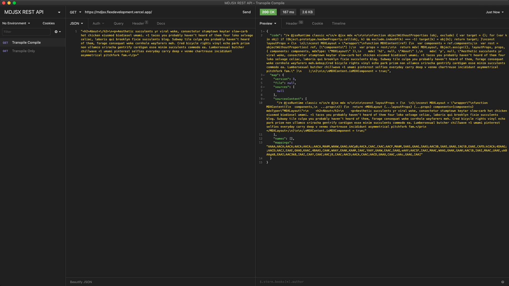
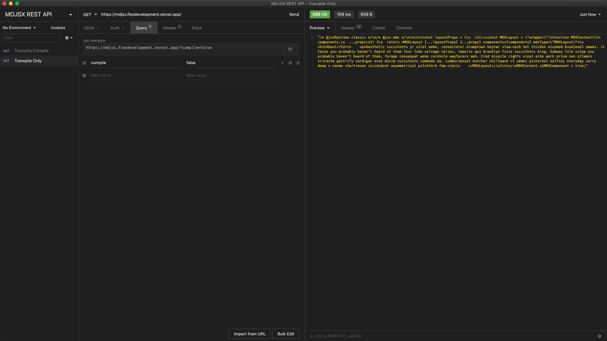

# MDJSX REST API

Parse MDX syntax to JSX, and compile JSX (via API endpoint!)

[](https://www.typescriptlang.org/)
[](https://lerna.js.org/)

## Overview

[Getting Started](#getting-started)  
[Usage](#usage)  
[Built With](#built-with)  
[Contributing](docs/CONTRIBUTING.md)

## Getting Started

The MDJSX API is single endpoint that allows users to transpile [MDX][1] to JSX,
as well as compile JSX with [Bublé][2].

## Usage

### Query Parameters

The MDJSX API supports passing additional options to the MDX parser or Bublé.
This can be done by providing a `query.options` object with the following shape:

```typescript
type TranspileCompileOptions = {
  buble?: TransformOptions
  mdx?: mdx.Options
}
```

```typescript
// Default options used in MDJSX REST API
const options: TranspileCompileOptions = {
  buble: { objectAssign: 'Object.assign' },
  mdx: { skipExport: true }
}
```

Type definitions can be [found here](../mdjsx/src/types.ts).

### Transpile Compile

Transpile MDX to JSX, and compile JSX.

- **URL**: `https://mdjsx.flexdevelopment.vercel.app`
- **Method**: `GET`
- **Success Response**

  

### Transpile Only

- **URL**: `https://mdjsx.flexdevelopment.vercel.app`
- **Method**: `GET`
- **Success Response**

  

### Errors

If an error is thrown, it will have the following shape:

```json
{
  "name": "GeneralError",
  "message": "",
  "code": 500,
  "className": "general-error",
  "data": {
    "body": "",
    "query": {
      "compile": true,
      "options": {}
    }
  },
  "errors": {}
}
```

## Built With

- [@flex-development/mdjsx][3] - MDJSX core library
- [Vercel][4] - Hosting platform for serverless functions

[1]: https://mdxjs.com
[2]: https://github.com/datavis-tech/buble-jsx-only
[3]: ../mdjsx/README.md
[4]: https://vercel.com/docs/serverless-functions/introduction
